# MANUAL DE CONFIGURACIÓN HIGH AVAILABILITY (HA)
## Clúster CARP / pfSense Plus - Netgate 8200 (Main & Secondary)

**FIREWALL PRINCIPAL | FIREWALL SECUNDARIO**

---

## TOPOLOGÍA HIGH AVAILABILITY (NETGATE 8200 PFSENSE)

```text
                       +------------------+
                       |      Cloud4      |
                       +--------+---------+
                                | eth0
                                |
                         +------+------+
                         | ISP (em1)   |
                         +------+------+
                                | em0 (192.168.2.4/24)
                                |
                         +------+------+
                         |   Switch2   |
                         +--+-------+--+
                         e0/         \e1
                          /           \
    WAN: 192.168.2.2/24  /             \ WAN: 192.168.2.3/24
                       em0             em0
                +---------------+   +---------------+
                |     Main      |   |   Secondary   |
                | (Firewall 1)  |   | (Firewall 2)  |
                +-------+-------+   +-------+-------+
                       em2             em2
                        |               |
                        +---------------+
                         SYNC IF: 172.16.0.2 <-> 172.16.0.3
                       em1             em1
    LAN: 192.168.1.2/24  \             / LAN: 192.168.1.3/24
                          \           /
                         e0\         /e1
                         +--+-------+--+
                         |   Switch1   |
                         +------+------+
                                | e2
                                | eth1
                       +--------+---------+
                       |      Cloud3      |
                       +------------------+
					   
					   
					   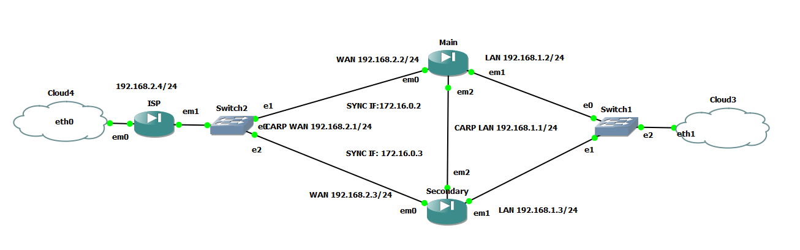

> **Virtual IPs (CARP):**
> - **CARP WAN:** `192.168.2.1/24` (VHID 1)
> - **CARP LAN:** `192.168.1.1/24` (VHID 2)

---

> **REQUISITO PREVIO:** Ambos nodos deben tener exactamente la **misma versión** de pfSense y la misma **zona horaria (Time Zone)**.

---

## 1. Resumen de la Topología y Tabla de Direccionamiento IP

A continuación se detallan las direcciones IP y las asignaciones de puerto basadas en el diagrama de red proporcionado:

| Interfaz / Función | Interfaz Física | Firewall MAIN (Primary) | Firewall SECONDARY (Backup) | IP Virtual (CARP) / Gateway |
| :--- | :---: | :---: | :---: | :---: |
| **WAN** | `em0` | `192.168.2.2/24` | `192.168.2.3/24` | `192.168.2.1/24` (VHID 1) |
| **LAN** | `em1` | `192.168.1.2/24` | `192.168.1.3/24` | `192.168.1.1/24` (VHID 2) |
| **SYNC (Heartbeat)** | `em2` | `172.16.0.2/24` | `172.16.0.3/24` | Directo / Switch Sync |
| **ISP Gateway** | — | — | — | `192.168.2.4` |

> **Nota Relevante sobre Interfaz SYNC:**  
> La interfaz `em2` se utiliza de forma dedicada para la sincronización de estados (`pfsync`) y reglas de configuración (`XMLRPC`). Se recomienda que esta conexión sea directa mediante un cable cruzado/directo o en una VLAN aislada.

---

## PASOS DE CONFIGURACIÓN

---

## 2. Configuración en el Nodo Principal (MAIN)

### PASO 1: Asignación de Interfaces y Reglas en SYNC (em2)

1. Vaya a **Interfaces > Asignación** (*Interfaces > Assignments*) y configure:
   - `em0` como **WAN** (IP Estática: `192.168.2.2/24`, Gateway: `192.168.2.4`).
   - `em1` como **LAN** (IP Estática: `192.168.1.2/24`).
   - `em2` como **SYNC** (IP Estática: `172.16.0.2/24`).

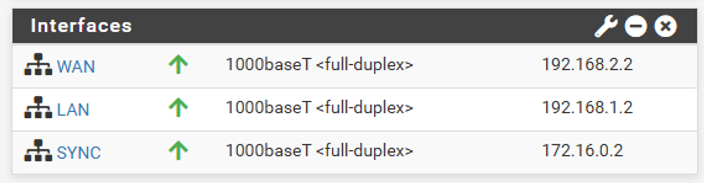

| Interfaces | Estado / Dúplex | Dirección IP |
| :--- | :---: | :--- |
| **WAN** | 1000baseT \<full-duplex\> | `192.168.2.2` |
| **LAN** | 1000baseT \<full-duplex\> | `192.168.1.2` |
| **SYNC** | 1000baseT \<full-duplex\> | `172.16.0.2` |

2. Vaya a **Firewall > Rules > SYNC** y agregue una regla de paso total:
   - **Action:** `Pass`
   - **Interface:** `SYNC`
   - **Address Family:** `IPv4`
   - **Protocol:** `Any`
   - **Source:** `SYNC subnets` (o `SYNC net`)
   - **Destination:** `Any`
   - **Description:** `SYNCHRONIZATION PERMIT RULE`

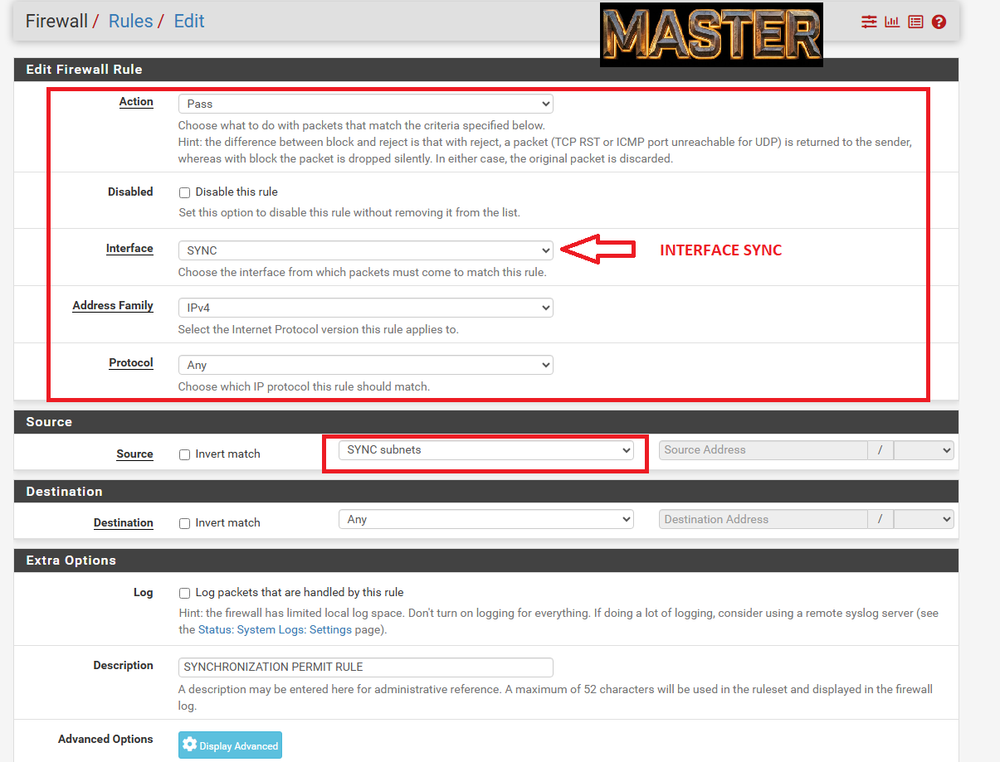

---

## 3. Configuración en el Nodo Secundario (SECONDARY)

### PASO 1: Asignación de Interfaces y Reglas en SYNC (em2)

1. Vaya a **Interfaces > Asignación** y configure:
   - `em0` como **WAN** (IP Estática: `192.168.2.3/24`, Gateway: `192.168.2.4`).
   - `em1` como **LAN** (IP Estática: `192.168.1.3/24`).
   - `em2` como **SYNC** (IP Estática: `172.16.0.3/24`).
   
   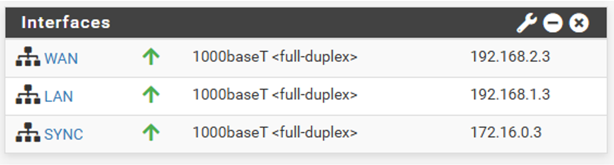

| Interfaces | Estado / Dúplex | Dirección IP |
| :--- | :---: | :--- |
| **WAN** | 1000baseT \<full-duplex\> | `192.168.2.3` |
| **LAN** | 1000baseT \<full-duplex\> | `192.168.1.3` |
| **SYNC** | 1000baseT \<full-duplex\> | `172.16.0.3` |

2. Vaya a **Firewall > Rules > SYNC** y agregue una regla de paso total:
   - **Action:** `Pass`
   - **Interface:** `SYNC`
   - **Address Family:** `IPv4`
   - **Protocol:** `Any`
   - **Source:** `SYNC subnets`
   - **Destination:** `Any`
   - **Description:** `SYNCHRONIZATION PERMIT RULE`
   
   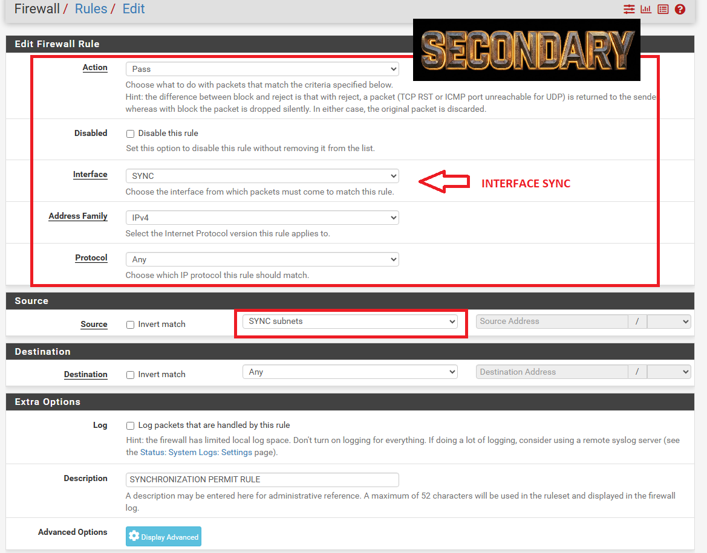

---

### PASO 2: Configuración de High Availability Sync (XMLRPC / pfsync) — SOLO EN EL MASTER

1. Vaya a **System > High Avail. Sync**.
2. **State Synchronization (pfsync):**
   - Marcar **Synchronize States** (`pfsync transfers state insertion, update, and deletion messages between firewalls`).
   - **pfsync Synchronize Interface:** Seleccionar `SYNC` (`em2`).
   - **pfsync Synchronize Peer IP:** Ingresar `172.16.0.3` (IP del nodo Secondary).
3. **Configuration Synchronization Settings (XMLRPC Sync):**
   - **Synchronize Config to IP:** Ingresar `172.16.0.3`.
   - **Remote System Username:** `admin`
   - **Remote System Password:** Contraseña del usuario `admin` del nodo Secondary.
   - Marcar **Synchronize admin**: `synchronize admin accounts and autoupdate sync password`.
   - Seleccionar los elementos a sincronizar (marcar **Toggle All** / casillas requeridas):
     - [x] User manager users and groups
     - [x] Authentication servers (e.g. LDAP, RADIUS)
     - [x] Certificate Authorities, Certificates, and Certificate Revocation Lists
     - [x] Firewall rules
     - [x] Firewall schedules
     - [x] Firewall aliases
     - [x] NAT configuration
     - [x] IPsec configuration
     - [x] OpenVPN configuration (Implies CA/Cert/CRL Sync)
     - [x] DHCP Server settings
     - [x] DHCP Relay settings
     - [x] DHCPv6 Relay settings
     - [x] WoL Server settings
     - [x] Static Route configuration
     - [x] Virtual IPs
     - [x] Traffic Shaper configuration
     - [x] Traffic Shaper Limiters configuration
     - [x] DNS Forwarder and DNS Resolver configurations
     - [x] Captive Portal

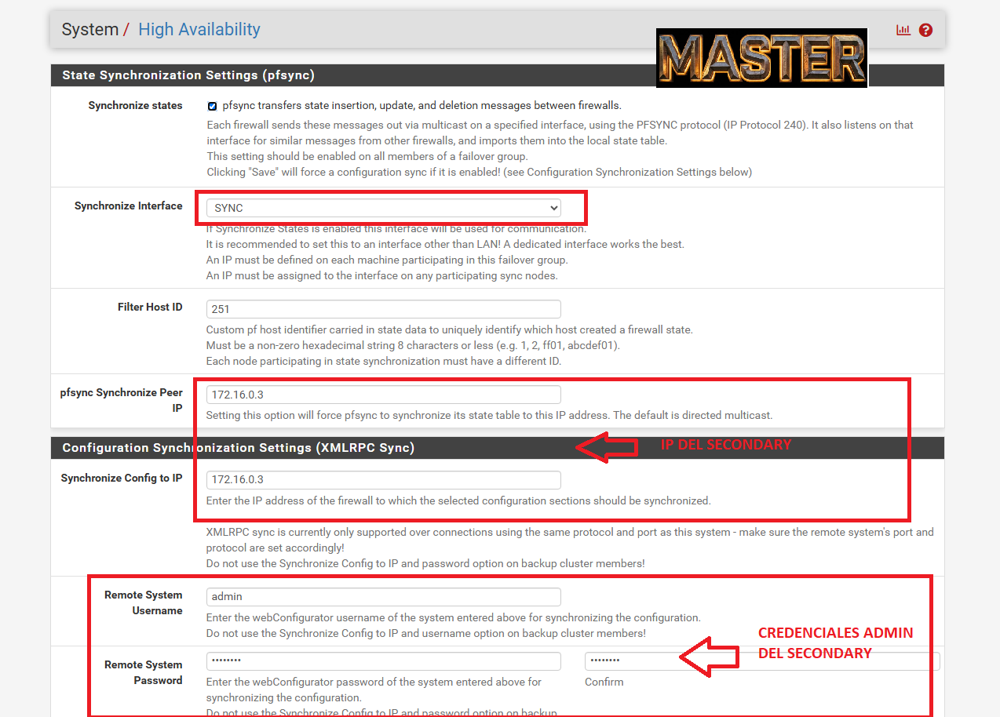
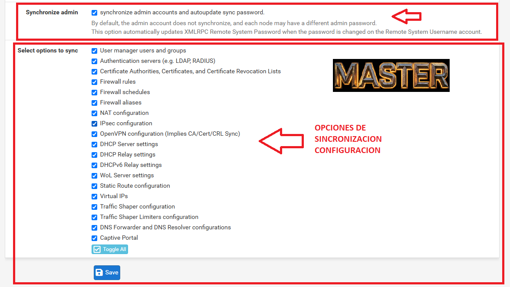

---

## VERIFICACIÓN DE FUNCIONAMIENTO DEL HA (SINCRONIZACIÓN XMLRPC)

1. Vaya a **System > User Management**.
2. Crear una cuenta de usuario en el Master (por ejemplo, el usuario `prueba`).
3. Una vez creada, la cuenta debe aparecer automáticamente en el **Secondary**.

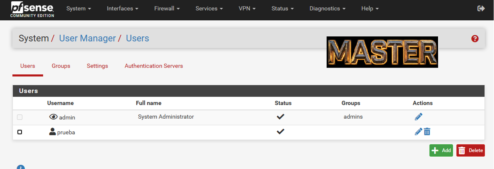

**Tabla de Usuarios en MASTER:**

| Username | Full name | Status | Groups | Actions |
| :--- | :--- | :---: | :--- | :---: |
| `admin` | System Administrator | ✔ | admins | ✏️ |
| `prueba` | — | ✔ | — | ✏️ 🗑️ |

**Tabla de Usuarios en SECONDARY (Verificación tras sincronización):**

| Username | Full name | Status | Groups | Actions |
| :--- | :--- | :---: | :--- | :---: |
| `admin` | System Administrator | ✔ | admins | ✏️ |
| `prueba` | — | ✔ | — | ✏️ 🗑️ |

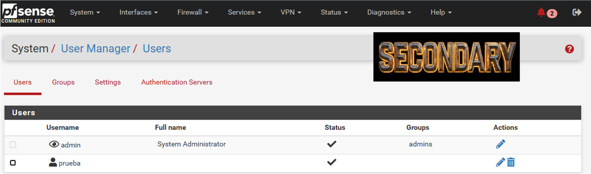
---

### PASO 3: Configuración de las IPs Virtuales CARP (VIPs) — SOLO EN EL MASTER

Vaya a **Firewall > Virtual IPs** y haga clic en **Add**.


#### 1. VIP LAN (Configuración en MASTER):
- **Type:** `CARP`
- **Interface:** `LAN` (`em1`)
- **Address Type:** `Single address`
- **Address(es):** `192.168.1.1 / 24`
- **Virtual IP Password:** Contraseña compartida del grupo CARP.
- **VHID Group:** `1` (o `2`)
- **Advertising Frequency:** Base `1`, Skew `0` (Master)
- **Description:** `CARP LAN IP`
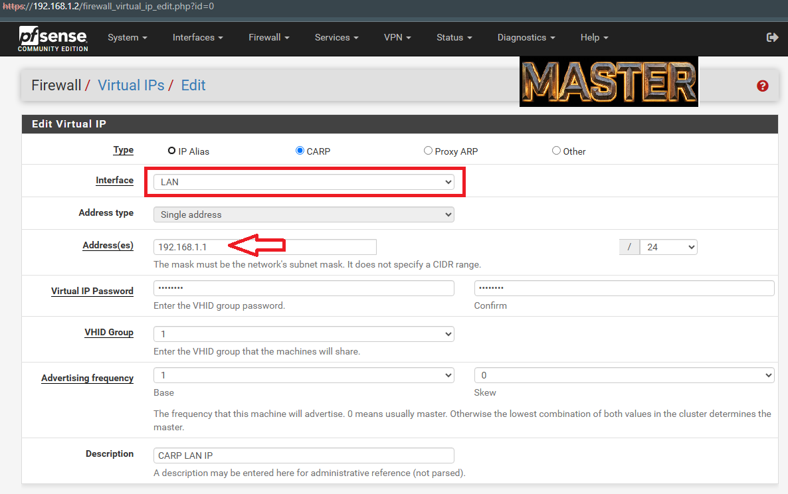

#### 2. VIP WAN (Configuración en MASTER):
- **Type:** `CARP`
- **Interface:** `WAN` (`em0`)
- **Address Type:** `Single address`
- **Address(es):** `192.168.2.1 / 24`
- **Virtual IP Password:** Contraseña compartida del grupo CARP.
- **VHID Group:** `2`
- **Advertising Frequency:** Base `1`, Skew `0` (Master)
- **Description:** `CARP WAN IP`
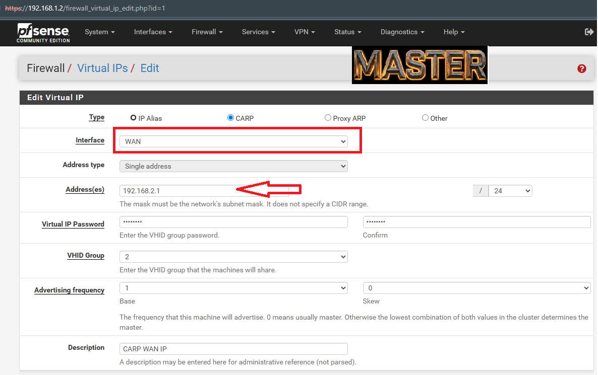

---

### PASO 4: Configuración de Outbound NAT (Traducción de Direcciones)

1. Vaya a **Firewall > NAT > Outbound**.
2. Cambie el modo de **Automatic** a **Hybrid Outbound NAT** o **Manual Outbound NAT**.
3. Edite o agregue la regla para la subred LAN (`192.168.1.0/24`) que sale por WAN:
   - **Interface:** `WAN`
   - **Source:** `LAN subnets` (`192.168.1.0/24`)
   - **Translation / NAT Address:** `192.168.2.1 (CARP WAN IP)`

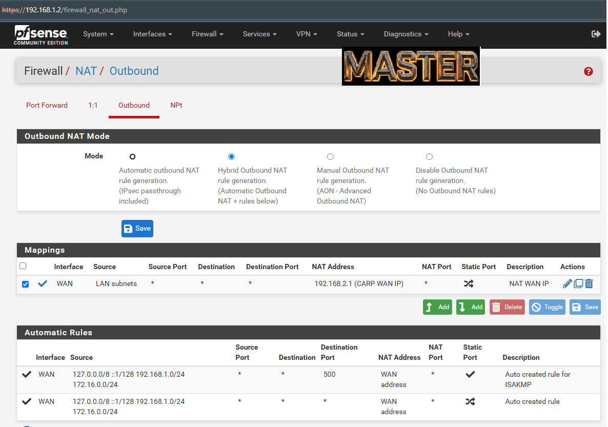

**Tabla Mappings (Outbound NAT):**

| Interface | Source | Source Port | Destination | Destination Port | NAT Address | NAT Port | Static Port | Description |
| :---: | :---: | :---: | :---: | :---: | :---: | :---: | :---: | :--- |
| **WAN** | LAN subnets | * | * | * | **192.168.2.1 (CARP WAN IP)** | * | 🔀 | NAT WAN IP |

---

## 4. Verificación y Pruebas de Failover

### PASO 1: Comprobación de Estado CARP

Vaya a **Status > CARP (vrrp)** en ambos equipos:

- **En MAIN:** Debe mostrar el estado **MASTER** para ambas VIPs (`192.168.2.1` y `192.168.1.1`).
- **En SECONDARY:** Debe mostrar el estado **BACKUP** para ambas VIPs.


**Estado CARP Normal (FIREWALL MAIN - MASTER):**

| Interface and VHID | Virtual IP Address | Description | Status |
| :--- | :--- | :--- | :---: |
| `LAN@1` | `192.168.1.1/24` | CARP LAN IP | **🟢 MASTER** |
| `WAN@2` | `192.168.2.1/24` | CARP WAN IP | **🟢 MASTER** |

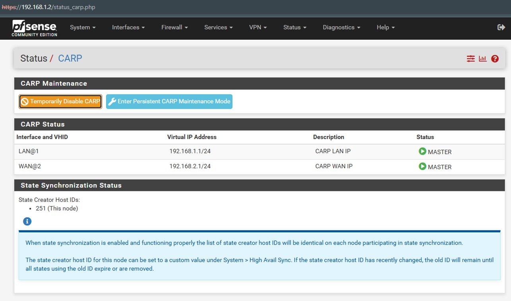

**Estado CARP Normal (FIREWALL SECONDARY - BACKUP):**

| Interface and VHID | Virtual IP Address | Description | Status |
| :--- | :--- | :--- | :---: |
| `LAN@1` | `192.168.1.1/24` | CARP LAN IP | **🟡 BACKUP** |
| `WAN@2` | `192.168.2.1/24` | CARP WAN IP | **🟡 BACKUP** |

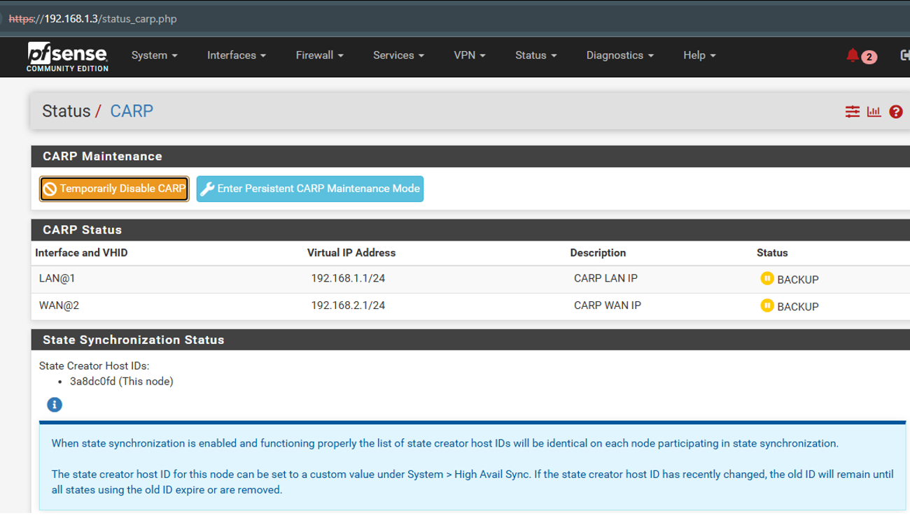
---

### PASO 2: Prueba de Conmutación en Caliente (Failover)

1. Desde un cliente en la LAN (ejemplo IP `192.168.1.10` con Gateway `192.168.1.1`), ejecute un ping continuo hacia una IP externa (ejemplo `1.1.1.1` o el gateway del ISP `192.168.2.4`):
ff
cmd
   ping 1.1.1.1 -t
   
   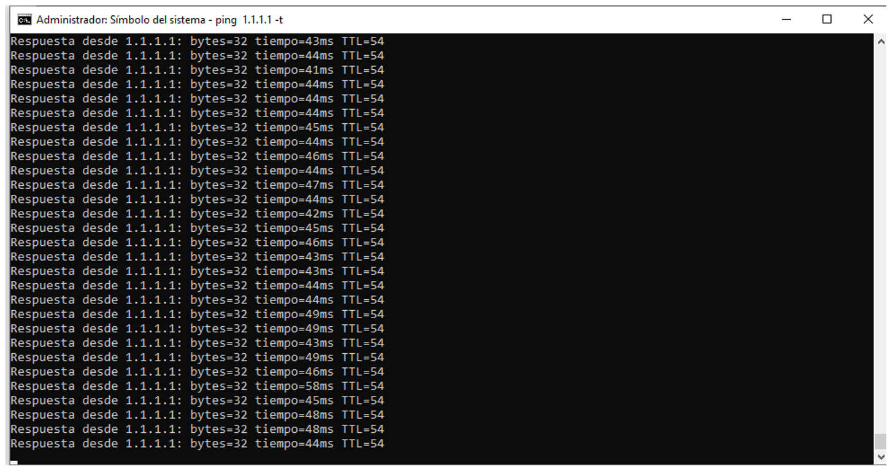
   
   2. Desconectar el cable LAN en el firewall principal:
   
    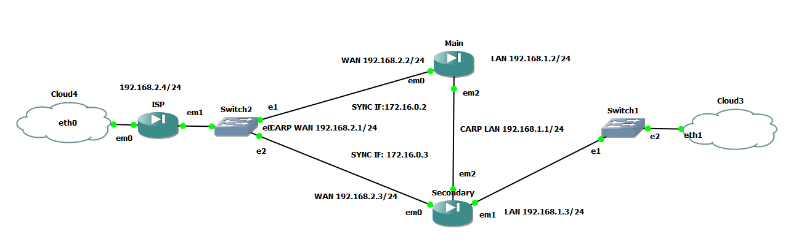
	
   2.1 Cambio de estado desde el firewall Main a secundario:
   (./images/14-cambio.png)
   
	3. Estado del firewall secundario:
	
   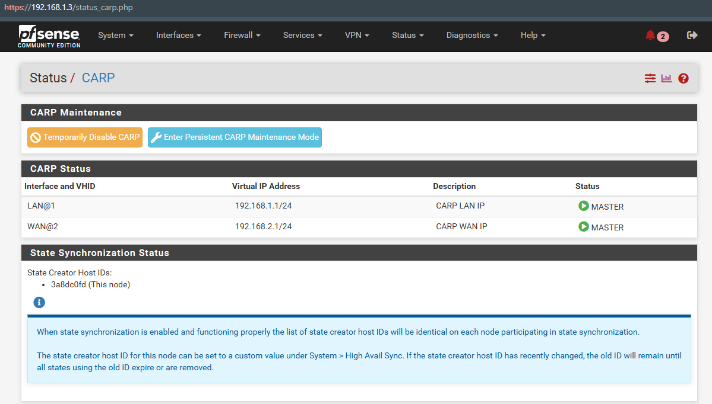
	
	4. Una vez restablecida la interface LAN el MAIN vuelve a ser el principal:
	
	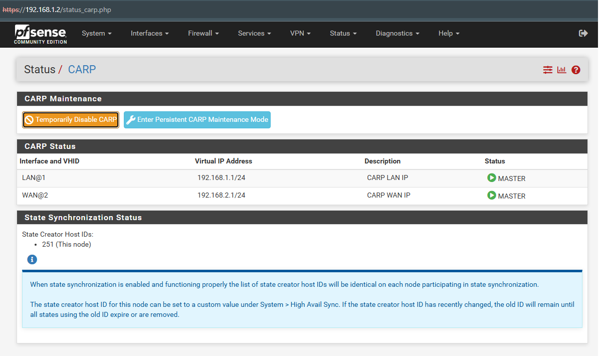
	
	Listo ya esta totalmente operativo
   
   ```