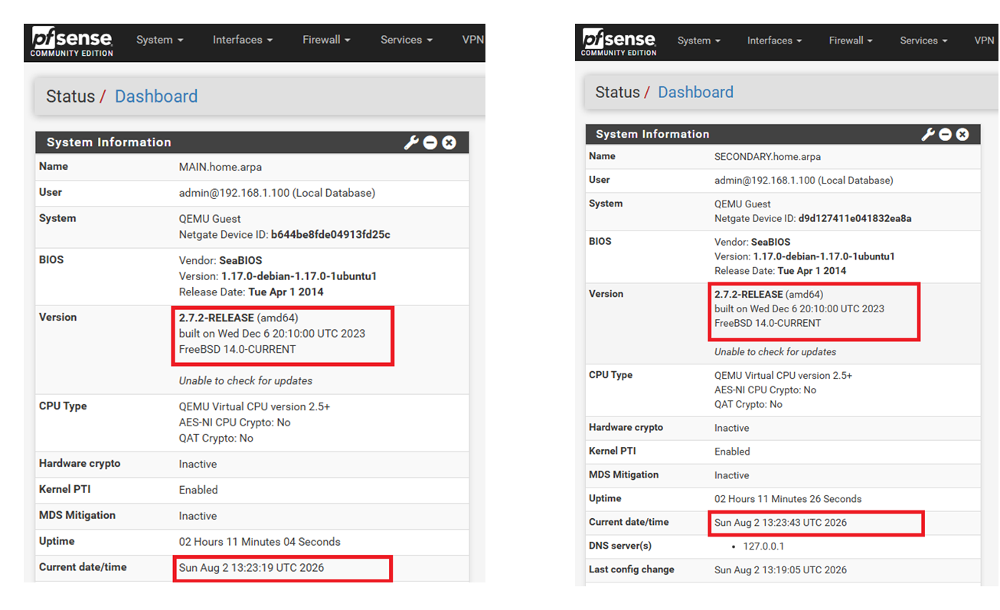

# MANUAL DE CONFIGURACIÓN HIGH AVAILABILITY (HA)
### Clúster CARP / pfSense Plus - Netgate 8200 (Main & Secondary)

---

## 1. Topología de Red y Direccionamiento IP

### Requisitos Previos
* **Versión del Sistema:** Ambos nodos deben tener instalada la misma versión de pfSense Plus.
* **Time Zone:** Ambos firewalls deben compartir la misma zona horaria sincronizada por NTP.

 

### Resumen de Direccionamiento IP

| Interfaz / Función | Interfaz Física | Firewall MAIN (Primary) | Firewall SECONDARY (Backup) | IP Virtual (CARP) / Gateway |
| :--- | :---: | :---: | :---: | :---: |
| **WAN** | `em0` | 192.168.2.2/24 | 192.168.2.3/24 | 192.168.2.1/24 (VHID 1) |
| **LAN** | `em1` | 192.168.1.2/24 | 192.168.1.3/24 | 192.168.1.1/24 (VHID 2) |
| **SYNC (Heartbeat)** | `em2` | 172.16.0.2/24 | 172.16.0.3/24 | Directo / Switch Sync |
| **ISP Gateway** | - | - | - | 192.168.2.4 |

> **Nota Relevante sobre Interfaz SYNC:**  
> La interfaz `em2` se utiliza de forma dedicada para la sincronización de estados (`pfsync`) y reglas de configuración (`XMLRPC`). Se recomienda que esta conexión sea directa mediante un cable cruzado/directo o en una VLAN aislada[cite: 1].

---

## 2. Configuración Base de Nodos

### PASO 1: Asignación de Interfaces y Reglas SYNC en Nodo Principal (MAIN)
1. Vaya a **Interfaces > Asignación** y configure:
   * `em0` como **WAN** (IP Estática: `192.168.2.2/24`, Gateway: `192.168.2.4`)[cite: 1].
   * `em1` como **LAN** (IP Estática: `192.168.1.2/24`)[cite: 1].
   * `em2` como **SYNC** (IP Estática: `172.16.0.2/24`)[cite: 1].
2. Vaya a **Firewall > Rules > SYNC** y agregue una regla de paso total:
   * **Action:** Pass | **Interface:** SYNC | **Address Family:** IPv4 | **Protocol:** Any | **Source:** SYNC net | **Destination:** Any[cite: 1].

 

### PASO 2: Asignación de Interfaces y Reglas SYNC en Nodo Secundario (SECONDARY)
1. Vaya a **Interfaces > Asignación** y configure:
   * `em0` como **WAN** (IP Estática: `192.168.2.3/24`, Gateway: `192.168.2.4`)[cite: 1].
   * `em1` como **LAN** (IP Estática: `192.168.1.3/24`)[cite: 1].
   * `em2` como **SYNC** (IP Estática: `172.16.0.3/24`)[cite: 1].
2. Vaya a **Firewall > Rules > SYNC** y agregue la misma regla de paso total[cite: 1].

---
